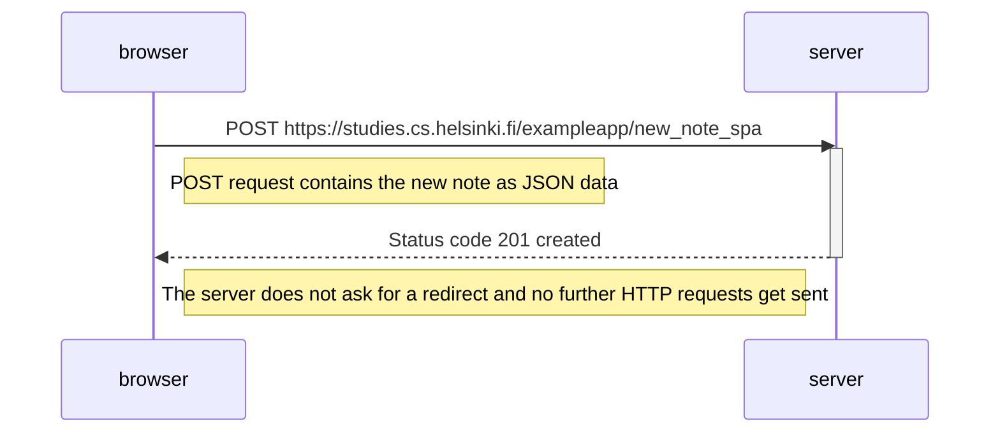

```mermaid
sequenceDiagram
    participant browser
    participant server

    browser->>server: POST https://studies.cs.helsinki.fi/exampleapp/new_note_spa
    activate server
    Note right of browser: POST request contains the new note as JSON data
    server-->>browser: Status code 201 created
    deactivate server
    Note right of browser: The server does not ask for a redirect and no further HTTP requests get sent
```
